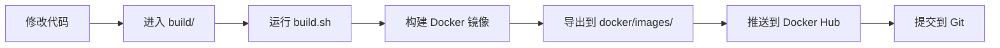
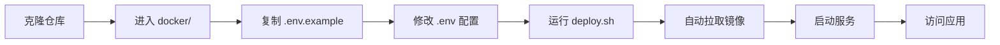

# 📦 Docker 部署架构说明

## 🎯 目录职责划分

### build/ - 开发者构建目录

**用途：** 开发者用于构建 Docker 镜像

**包含文件：**
- `Dockerfile` - 多阶段构建配置
- `docker-compose.build.yml` - 构建配置
- `build.sh` / `build.ps1` - 构建脚本
- `README.md` - 构建指南

**工作流程：**
```bash
# 开发者在 build 目录执行
cd build
./build.sh          # Linux/macOS
.\build.ps1         # Windows

# 输出镜像到 docker/images/ 目录
```

---

### docker/ - 用户部署目录

**用途：** 用户直接用于生产环境部署（无需构建）

**包含文件：**
- `docker-compose.yml` - 生产环境编排配置
- `nginx.conf` - Nginx 反向代理配置
- `.env.example` - 环境变量模板
- `deploy.sh` / `deploy.ps1` - 部署脚本
- `README.md` - 完整部署指南（唯一文档）

**工作流程：**
```bash
# 用户在 docker 目录执行
cd docker
cp .env.example .env
nano .env           # 修改配置
./deploy.sh         # Linux/macOS
.\deploy.ps1        # Windows

# 自动拉取预构建镜像并启动
```

---

## 🏗️ 架构设计

### 分离原则

| 维度 | build/ | docker/ |
|------|--------|---------|
| **使用者** | 开发者 | 最终用户 |
| **操作** | 构建镜像 | 部署运行 |
| **输入** | 源代码 | 预构建镜像 |
| **输出** | Docker 镜像 | 运行中的服务 |
| **复杂度** | 高（需要编译） | 低（只需配置） |

### 镜像命名规范

- **镜像名称**: `danwangshi/lof-fund-app`
- **标签**: `latest` 或版本号（如 `v1.2.0`）
- **导出文件**: `danwangshi-lof-fund-app-latest.tar.gz`

---

## 🔄 完整工作流程

### 开发者流程



**命令示例：**
```bash
cd LOF-Fund-Tools

# 1. 构建镜像
cd build
./build.sh v1.2.0

# 2. 推送镜像
docker push danwangshi/lof-fund-app:v1.2.0

# 3. 提交代码
git add .
git commit -m "Update to v1.2.0"
git push
```

### 用户流程



**命令示例：**
```bash
# 1. 克隆项目
git clone https://github.com/danwangshi/LOF-Fund-Tools.git
cd LOF-Fund-Tools/docker

# 2. 配置环境
cp .env.example .env
nano .env  # 修改数据库密码

# 3. 一键部署
./deploy.sh
# 选择选项 1) 拉取最新镜像并启动服务
```

---

## 📋 配置文件对比

### docker-compose 文件

| 文件 | 位置 | 用途 |
|------|------|------|
| `docker-compose.build.yml` | build/ | 仅用于构建镜像 |
| `docker-compose.yml` | docker/ | 生产环境运行配置 |

**关键区别：**
- `build/` 版本包含 `build:` 指令
- `docker/` 版本使用 `image:` 指令（预构建镜像）

### 环境变量文件

| 文件 | 位置 | 用途 |
|------|------|------|
| `.env.example` | docker/ | 用户配置模板 |

**注意：** build/ 目录不需要 .env 文件

---

## 🚀 部署方式

### 方式一：从 Docker Hub 拉取（推荐）

```bash
cd docker
cp .env.example .env
# 编辑 .env
docker compose pull
docker compose up -d
```

### 方式二：从本地镜像加载

```bash
# 开发者构建后导出镜像
cd build
./build.sh

# 用户加载镜像
cd ../docker
docker load -i ../docker/images/danwangshi-lof-fund-app-latest.tar.gz
docker compose up -d
```

### 方式三：现场构建（不推荐）

```bash
# 仅在无法获取预构建镜像时使用
cd build
docker build -f Dockerfile -t danwangshi/lof-fund-app:latest ..

cd ../docker
docker compose up -d
```

---

## 🔑 关键配置项

### 必须修改的配置

```bash
# docker/.env 文件中
DB_PASSWORD=YourStrongPassword123!  # ⚠️ 必须修改
```

### 可选配置

```bash
# 端口配置
HTTP_PORT=80
HTTPS_PORT=443

# 企业微信通知
WEWORK_ENABLED=false
WEWORK_CONFIG=

# 日志级别
LOG_LEVEL=INFO
```

---

## 📊 服务架构

```
用户浏览器
    ↓
Nginx (端口 80/443)
    ├── 静态文件服务
    └── API 代理 → Flask App (内部网络)
                      ↓
                  PostgreSQL (内部网络)
```

**三个容器：**
1. **lof-nginx** - Nginx 反向代理
2. **lof-app** - Flask 后端应用
3. **lof-postgres** - PostgreSQL 数据库

---

## 🛠️ 常用命令速查

### 开发者命令

```bash
# 构建镜像
cd build && ./build.sh

# 测试镜像
docker run -p 5000:5000 danwangshi/lof-fund-app:latest

# 推送镜像
docker push danwangshi/lof-fund-app:latest
```

### 用户命令

```bash
# 部署服务
cd docker && ./deploy.sh

# 查看状态
docker compose ps

# 查看日志
docker compose logs -f

# 重启服务
docker compose restart

# 备份数据库
docker exec lof-postgres pg_dump -U postgres lof_funds > backup.sql
```

---

## ❓ 常见问题

### Q: 为什么要有两个目录？

**A:** 
- **build/** - 给开发者用，需要编译和构建
- **docker/** - 给用户用，只需配置和运行

这样用户可以快速部署，无需等待漫长的构建过程。

### Q: 如何更新到最新版本？

**A:**
```bash
cd docker
./deploy.sh
# 选择选项 1) 拉取最新镜像并启动服务
```

### Q: 可以修改 docker/ 目录的文件吗？

**A:** 
- ✅ 可以修改 `.env` 配置文件
- ❌ 不要修改 `docker-compose.yml` 和 `nginx.conf`（除非你知道自己在做什么）

### Q: 镜像存储在哪里？

**A:** 
- 开发者构建的镜像存储在 `docker/images/` 目录
- 用户拉取的镜像存储在 Docker 本地仓库

---

## 📝 相关文档

- [build/README.md](build/README.md) - 开发者构建指南
- [docker/README.md](docker/README.md) - 用户部署指南（唯一文档）

---

## 💡 最佳实践

1. **开发者**：每次发布新版本都要构建并推送镜像
2. **用户**：始终使用预构建镜像，不要现场构建
3. **安全**：务必修改数据库密码，不要使用默认值
4. **备份**：定期备份数据库，至少保留 30 天
5. **监控**：定期检查服务状态和日志
